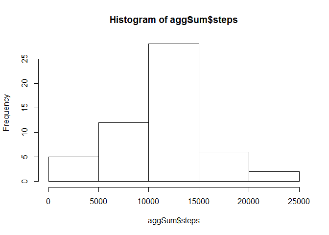
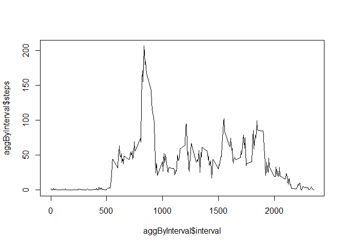
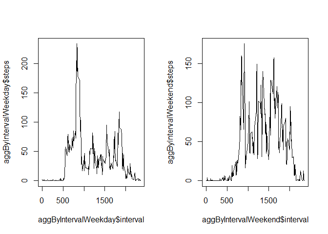

## Loading and preprocessing the data


```r
data <- read.csv("activity.csv")
data$date <- as.Date(data$date)
```

## What is mean total number of steps taken per day?

```r
aggSum <- aggregate(steps ~ date, data, sum)
hist(aggSum$steps)
```

<!-- -->

```r
print(median(aggSum$steps))
```

```
## [1] 10765
```

```r
print(mean(aggSum$steps))
```

```
## [1] 10766.19
```

## What is the average daily activity pattern?

```r
aggByInterval <- aggregate(steps ~ interval, data, mean)
plot(aggByInterval$interval, aggByInterval$steps, type = "l")
```

<!-- -->

```r
print(aggByInterval[which.max(aggByInterval$steps), ])
```

```
##     interval    steps
## 104      835 206.1698
```

## Imputing missing values

```r
dataImput <- data
aggMean <- aggregate(steps ~ interval, dataImput, mean)
for (i in 1:nrow(dataImput)) {
    if (is.na(dataImput[i, ]$steps)) {
        dataImput[i, 1] <- aggMean[aggMean$interval == data[i, ]$interval, ]$steps
    }
}
print (sum(is.na(data$steps)))
```

```
## [1] 2304
```

## Are there differences in activity patterns between weekdays and weekends?

```r
data$weekday <- as.factor(weekdays(data$date))
data$type <- NA

for (i in 1:nrow(data)) {
    if (data[i, ]$weekday == "Saturday" || data[i, ]$weekday == "Sunday") {
        data[i, ]$type <- "weekend"
    } else {
        data[i, ]$type <- "weekday"
    }
}

data$type <- as.factor(data$type)


dataWeekday <- data[data$type == "weekday", ]
dataWeekend <- data[data$type == "weekend", ]

aggByIntervalWeekday <- aggregate(steps ~ interval, dataWeekday, mean)
aggByIntervalWeekend <- aggregate(steps ~ interval, dataWeekend, mean)

par(mfcol = c(1,2))
plot(aggByIntervalWeekday$interval, aggByIntervalWeekday$steps, type = "l")
plot(aggByIntervalWeekend$interval, aggByIntervalWeekend$steps, type = "l")
```

<!-- -->
